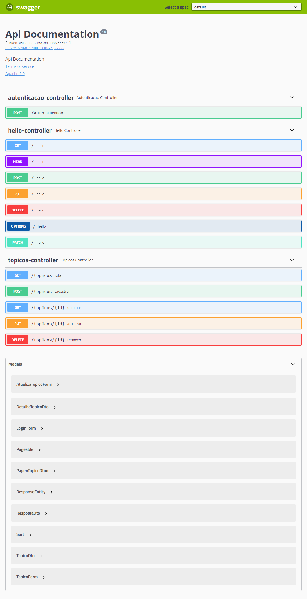

# course-alura-spring-boot (III)

Result of course **[Spring Boot Parte 3: Profiles, Testes e Deploy](https://cursos.alura.com.br/course/spring-boot-profiles-testes-deploy)** of [Alura](https://alura.com.br).

## What you need

- [JDK 1.8](http://www.oracle.com/technetwork/java/javase/downloads/index.html) or later
- [Maven 3.2+](https://maven.apache.org/download.cgi)

## Run

### Manual

- forum-app

    ```bash
    $ cd forum-app
    $ ./mvnw spring-boot:run
    ```

- forum-monitor

    ```bash
    $ cd forum-monitor
    $ ./mvnw spring-boot:run
    ```

### Container

- Start

    ```bash
    $ cd forum-app && ./mvnw clean package && cd ../forum-monitor && ./mvnw clean package
    $ docker-compose up --build
    ```

- Stop

    ```bash
    $ docker-compose down
    ```

## Usage

- forum-app

    > http://localhost:8080/swagger-ui.html
    

- forum-monitor

    > http://localhost:8081
    
